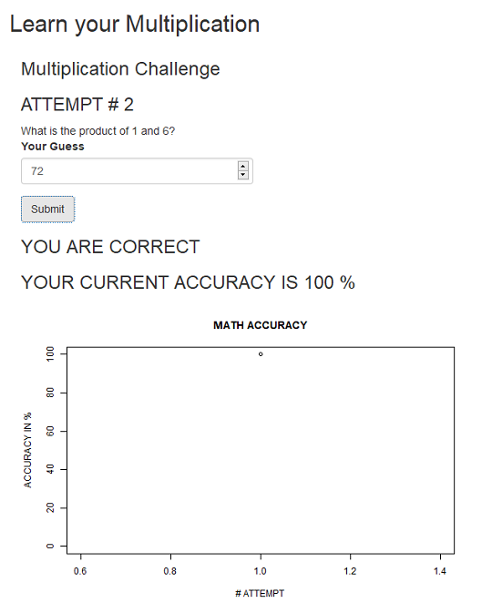
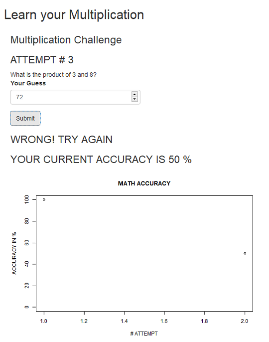
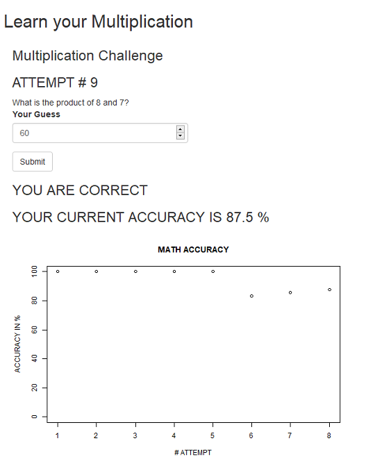

<style>
.small-code pre code {
  font-size: 1em;
}
</style>

Math Checker Intro
========================================================
author: Tommy Brant
date: August 24, 2019
autosize: true
App Name: Math Checker

Application Description
========================================================
- What is it?
  - This app queries the user to put in the result of multiplication for two numbers. Based on user's answer, the accuracy of the user input is tracked and plotted over the course of their attempts.

- Why use it?
  - Mainly: to test your multiplication, and track your accuracy
  - Secondly: Exercise your mind!
  


Slide With Code 
========================================================
class: small-code
Code snippet that validate's correctness and tracks accuracy


```r
  observeEvent(input$calcAcc, {
    counter$countervalue <- (counter$countervalue + 1) 
    #PUT THIS IN ARRAY SO ACCURACY CAN PLOT
    if (input$num3 == num2$num2*num1$num1) {
      corrAnswCounter$countervalue<-(corrAnswCounter$countervalue + 1) 
      output$num3<-renderText({"YOU ARE CORRECT"})
    }
    else {output$num3<-renderText("WRONG! TRY AGAIN")}
    calc$acc <- (corrAnswCounter$countervalue/counter$countervalue)*100
    counterArray$index[counter$countervalue] <- counter$countervalue 
    calcArray$acc[counter$countervalue] <- calc$acc
  }
```


Validation Operation 
========================================================
Upon success, the user is notified their guess is correct, and the accuracy increases.



***

Upon error, the user is notified their guess is incorrect, and the accuracy decreases.



App Functionality
========================================================

User provides their answer, and  clicks 'Submit'

App perform a check against the user's answer, and provides feedback which updates after each attempt.



App Resources
========================================================


- App Link: https://teebomb.shinyapps.io/ShinyTest/
  
- Source Code: https://github.com/teebomb/Math-Checker-App

- Presentation: http://rpubs.com/Tombomb/522140


